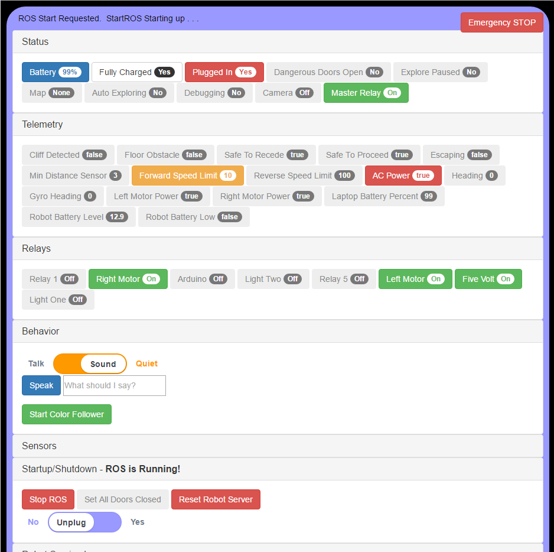
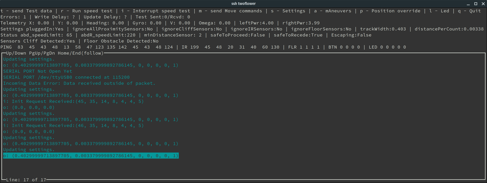

[](https://github.com/chrisl8/ArloBot/actions/workflows/node.js.yml)
[](https://github.com/chrisl8/ArloBot/actions/workflows/react.js.yml)
[](https://github.com/chrisl8/ArloBot/actions/workflows/setup-jazzy.yml)

**WARNING: The Jazzy setup branch DOES NOT WORK!!!**
I've started dabbling with converting my robot to work with ROS2 Jazzy, but this is a long road. Nothing here works yet!

ArloBot Package for ROS
=======================

Here is a [YouTube Video](https://youtu.be/k15B0RdpVYQ) of this robot in action.

## and SO MUCH MORE! ##

 - This package provides a set of ROS packages for using a [Parallax Arlo Platform](https://www.parallax.com/product/arlo-robotic-platform-system "Parallax") robot to create and navigate a map of a room (Simultaneous Mapping and Localization) via [Robot Operating System (ROS)](https://www.ros.org/ "ROS").  Originally based on the old [TurtleBot](https://wiki.ros.org/Robots/TurtleBot "TurtleBot").

This package also includes:
 0. An all in one install script that should get things as close to working as possible by running one install script.
 1. A Python and Curses based Serial Interface testing utility to help diagnose problems and confirm your hardware is working.
 2. A set of Bash script utilities to help in working with the robot.
 4. A set of Node.js based utilities to automate many repeated tasks.
 5. A Node.js based Server to run the robot at all times, along with:
 6. A React based web GUI to interact with the robot.
 7. Other fun things like Pushover integration.

### Mobile Friendly Web Interface  


### Curses Serial Testing Interface:  
`~/dev_ws/src/ArloBot/scripts/PropellerSerialTest.sh`  


* A Python Curses based serial communications test program allows testing of ALL Propeller board functions over serial with zero use of ROS to more easily ensure the hardware is working before starting ROS.

# Maintenance Only Status Notes

The [Arlo Robot System](https://www.parallax.com/product/28966) by Parallax has been discontinued. At this moment they are entirely out of stock, so this project's usefulness slowly grows to an end, although my personal implementation, which has always been the primary focus of this repository, lives on as I run my robot almost daily.

# Build a Robot! #
First you need to build a robot!

## Parts List ##
* Robot
* On board computer
* 3D Sensor

**This code is based on the [Arlo Robotic Platform](https://www.parallax.com/product/28966) from Parallax.  Unfortunately, the [Arlo Robotic Platform](https://www.parallax.com/product/28966) has been DISCONTINUED.**

You will also need a few other items (Raspberry Pi and 3D sensor) which I have some details about on the [Parts List Wiki Page](https://github.com/chrisl8/ArloBot/wiki/Parts-List " Parts List")

## Building ##
Follow the excellent [Arlo Robot Assembly Guide](https://learn.parallax.com/tutorials/robot/arlo/arlo-robot-assembly-guide "Assembly Guide") at Parallax to both assemble and test your Arlo Robot platform.  
 Be sure you have fully understood and run all of their tests before moving on with using ROS.

Check out my blog: [ArloBot Build Index](https://log.voidshipephemeral.space/Arlobot/ArloBot+Build+Index "Ekpyrotic Frood Blog")

And also jump on the [Parallax Forums](https://forums.parallax.com/ "Parallax Forums") and start searching and asking questions!

Because the Arlo platform comes as a kit, building it should be pretty straight forward, but we will all help you out with any problems you run into.  
Ask questions in the [Parallax Forums](https://forums.parallax.com/ "Parallax Forums"), on [GitHub](https://github.com/chrisl8/ArloBot/issues "Create an Issue") and on the [ROS for Arlobot Google Group](https://groups.google.com/g/ros-for-arlobot "ROS for Arlobot").

Once your robot is built, you can use this package.

## Requirements ##
## Operating System ##
Arlobot operates on ROS Jazzy which requires Ubuntu *24.04 LTS*.

This repository is built around running on a Raspberry Pi 4 with Ubuntu Server 24.04 LTS, which is also what [ROS2 requires](https://docs.ros.org/en/jazzy/How-To-Guides/Installing-on-Raspberry-Pi.html).

If you put a fresh copy of Ubuntu Server 24.04 LTS on your robot's Raspberry Pi then you can use the installation script below.

You can use Desktop instead of Server if you want, but Server will save memory by not running a desktop environment. This is your choice of course, but I'm using Server.

I suggest using the [Raspberry Pi Imager](https://www.raspberrypi.com/software/) to write the Ubuntu image to your SD card. 

I suggest setting a hostname, a user and password and your WiFi. The setup script and instructions should work with whatever non-root user you set up. My username is `chrisl8` so anytime you see that you can substitute your own.

## Install
There is a script to install everything. Run:

```
bash <(wget -qO- --no-cache -o /dev/null https://raw.githubusercontent.com/chrisl8/ArloBot/jazzy/setup-jazzy.sh)
```

Be sure to read the instructions that the script will print at the end about editing the config files in `~/.arlobot/`

To update your code run the same script again, and it will pull down and compile anything new without erasing custom settings.

## Propeller Code
Please note that you will need the code to run on your Propeller board. This is stored in the "PropellerCodeForArloBot" folder. Details on the Propeller code and setup are here: [Propeller Cdoe for Arlobot](https://log.voidshipephemeral.space/Arlobot/Propeller+Code+for+Arlobot+(PropWare+Version))

You can run the script `install_Propeller_code.sh` to automatically install the required code to your Propeller Activity Board.

## Propeller Serial Interface Test ##
Before you start trying to get ROS running, but after you have loaded the C code onto the Propeller Activity board, use the PropellerSerialTest to test the hardware and interface.  

Place the robot up on blocks, so it won't drive into anything if it goes nuts, and then run:  
`~/dev_ws/src/ArloBot/scripts/PropellerSerialTest.sh`  
This provides an interface to send all controls, commands, and settings directly to the Propeller Activity Board without involving ROS. Use this to test everything and make sure your robot's hardware is functioning before you start playing with ROS.

#### Serial Test Usage
0. Make sure the robot is on blocks off of the floor so when the motors run it will stay still and not run into anything.  
1. On the robot run `~/dev_ws/src/ArloBot/scripts/PropellerSerialTest.sh` It will not start moving or doing anything yet, but it may soon! 
2. The Proximity Sensors, that is the PING and/or InfraRed (IR) sensors, can cause the robot to move to avoid obstacles or refuse to move when commanded to. The bottom row of the status shows their measurements. The second from the bottom row shows if the Propeller Activity Board's built in safety code has determined if it is safe to move forward or backward or not at all.  There is also the line `Escaping:False` which indicates if the code is attempting to move to get away from something too close.  
Since we are on blocks, let's turn this off, so it won't run the motors unless we tell it to. This will prevent it from just driving the wheels in response to you or something close to your test setup.  
Pres `s` for Settings and then `a` to ignore All proximity sensors.  
The line next to `Settings` that says `ignoreAllProximitySensors:No` will change to `ignoreAllProximitySensors:Yes`.
3. Next note along the `Settings` line that `pluggedIn` is `Yes`. This will prevent the Propeller Activity Board code from sending any commands to the motor. Normally the only way to override this is through ROS. It is a safety measure that prevents the robot from ever moving if ROS is not running. We will override this now. If you left the Settings menu press `s` to get back in. Then `p` for Plugged in to turn that off.  `pluggedIn:Yes` will change to `pluggedIn:Yes` Now the robot can move.  
4. Now `q` to get out of Settings and `m` to send Move commands.  Use the letters `i` to make the wheels move the robot forward.  
** IT WORKS!  **
You should probably test all the functions available, but this has at least shown you how to use the test program and that your hardware is working.  You can use the Sensor output data to ensure your sensors work and diagnose issues with your hardware or code settings.  
There is also the ability to send Test packets to the robot to check for serious serial errors.  
Note that if you do the `r - Run speed test` there will be errors. It basically tests the ability for the code to slow down the transfer rate until the connection is stable, so errors will pop up as it attempts to go too fast and then backs off and retries. This is normal.  

## Quick Start of Entire Robot: ##
The default install script will actually set up the robot website to start automatically on system boot.  
You can see the status of this by running: `pm2 log`  
You will even see the URL to use printed in the log output.

If the Web Interface is not already running, you can start it by hand by running:
```
~/dev_ws/src/ArloBot/startRobot.sh
```
and point your web browser at the URL it gives you.

If you use Ubuntu there should also be a desktop icon on the robot's desktop which you can run to do the same thing and bring up this web page on the robot itself.

## RViz on Windows

You can install ROS 2 with RViz on your windows host if that is your primary OS, just for watching and controlling navigation.

TODO: Test this and update the instructions in the wiki below:
https://docs.ros.org/en/jazzy/Installation/Windows-Install-Binary.html

[Running Rviz on Windows](https://github.com/chrisl8/ArloBot/wiki/Running-Rviz-on-Windows)

## Updating Code

To update your code just run the same script again, and it will pull down and compile anything new without erasing custom settings.

## Full Arlobot Setup Instructions: ##
Complete setup and usage instructions are at my blog:  
[ArloBot Build Index](https://log.voidshipephemeral.space/Arlobot/ArloBot+Build+Index)

## Edit your robot's Description ##
`roscd arlobot_ros/urdf`  
and then read the Readme.txt file there!

## WARNING: BY DEFAULT YOUR ROBOT WILL TRY TO MOVE EVEN WHEN IT IS PLUGGED IN!!!!

## NOTE: Robot may be stuck or moving in response to sensors
The Infrared, PING, and "plugged in" state of the robot can prevent it from moving or cause it to move by itself.  
Once ROS is running, if you want to ensure that ONLY ROS input causes movement, and that the robot responds to ROS even if the PING or IR sensors sense an obstacle, you can quickly tell it to ignore all sensor input by running:  
`~/dev_ws/src/ArloBot/scripts/ignoreAllSensors.sh`  
Notice that you must run that **AFTER ROS is started**, and run it every time you start ROS when testing with sensors ignored.

# Basic ROS based usage instructions #
*Note that you can do everything meaningful via the Web Interface. These instructions and scripts are here for reference, debugging, and learning.*  
Depending on what you want to do there are different ways to "bring up" the robot with just ROS.<br/>These are the "recipes" that are well tested so far:

### Basic TeleOp with 3D sensor use ###
Note that the `start-robot.sh` script is the **same thing** as pressing the "Start ROS" button in the Web Interface.  
It helps to make sure that it runs properly from the command line though before relying on the web interface, in case there were setup issues.
```
# Run:
start-robot.sh
# In a new Terminal:
roslaunch arlobot_ros keyboard_teleop.launch
# From a Terminal in the desktop (NOT over SSH):
view-navigation.sh
```
##### Do this:
  - Set your Global Options->Fixed Frame to "odom
  - Look at the Scan output to see if it is producing an image of the room.
  - Drive and see if the robot appears to move properly on the grid.

### Slam Toolbox (SLAM Map building) ###
https://github.com/SteveMacenski/slam_toolbox  
Note that the `make-map.sh` script is the **same thing** as pressing the "Make Map" button in the Web Interface, and  
`save-map.sh` is the SAME thing as pressing the "Save Map" button in the Web Interface.  
It helps to make sure that it runs properly from the command line though before relying on the web interface, in case there were setup issues.
```
# Run:
start-robot.sh
# In a new Terminal:
make-map.sh
# From a Terminal in the desktop (NOT over SSH):
view-navigation.sh
# When you are done, save your map!
save-map.sh "${HOME}/.arlobot/rosmaps/my_map1"
```
##### Do this:
- Ensure obstacles in the 3D Camera view are shown in the local cost map
- Use the "2D Nav Goal" to set destinations for the robot to navigate to.
- Once you have built a map you are happy with, save it.

### Localization (Navigating the map we built above ###
Note that the `load-map.sh` script is the **same thing** as pressing the "Load Map" button in the Web Interface, and  
`save-map.sh` is the SAME thing as pressing the "Save Map" button in the Web Interface.  
It helps to make sure that it runs properly from the command line though before relying on the web interface, in case there were setup issues.
```
# Run:
start-robot.sh
# In a new Terminal:
load-map.sh "${HOME}/.arlobot/rosmaps/my_map1"
# From a Terminal in the desktop (NOT over SSH):
view-navigation.sh
```

### Remote Control with an xBox 360 Joystick ###
[Using an xBox 360 Joystick with ROS](https://log.voidshipephemeral.space/Ancient+History/2014/Using+an+xBox+360+Joystick+with+ROS)  
This should work as soon as you Start ROS, either with `start-robot.sh` or with the Web Interface.

# Rviz
The easiest way to bring up Rviz is with the script:
```
view-navigation.sh
```
In theory one may want to bring this up on a different computer than the robot's on-board computer.
That is possible, especially if you ran the bash setup script on that other computer and selected "Y" to make it a "workstation".
That said, you will need to ensure your ROS environment variables are set up correctly. If you are having trouble either with ROS on your remote workstation saying that it cannot see the robot, or with setting destination snot working in Rviz, check out this page for assistance:  

http://wiki.ros.org/ROS/NetworkSetup

# Assistance

Please report an issue for any problems or if you need me to clarify anything!  
 Ask questions in the [Parallax Forums](https://forums.parallax.com/ "Parallax Forums"), on [GitHub](https://github.com/chrisl8/ArloBot/issues "Create an Issue") and on the [ROS for Arlobot Google Group](https://groups.google.com/g/ros-for-arlobot "ROS for Arlobot"). I will write more documentation as I answer questions, and I hope you will also write instructions when you do your build!


# Scripts

Here is a list of the "convenience scripts" that I have written for Arlobot. Many are used by the web site. All of them can be run directly by you if you need or want to. 

All of the functions above also have quick launch scripts.
`cd ~/dev_ws/src/ArloBot/scripts`

### Start ROS ###
Start just the most basic pieces  
`start-arlobot-only.sh`  
OR  
Start everything:  
`start-robot.sh`
### Basic TeleOp ###
`keyboard-teleop.sh`
### Remote Control with an xBox 360 Joystick ###
This is built into the `start-robot.sh` script.
### Slam Toolbox (SLAM Map building) ###
`make-map.sh`  
View with rviz:  
`view-navigation.sh`  
Save the map:  
`save-map.sh`
### Slam Toolbox Localization Mode (Navigating the map we built above) ###
List available maps:  
`listMaps.sh`  
Load the map:  
`load-map.sh`  
View with rviz:
`view-navigation.sh`
### Shut down ROS and everything related to it ###
`kill_ros.sh`

The scripts call ROS files, so you can modify the ROS files listed in the scripts to modify how ROS operates.

Note that xBox 360 Controller operation is always live when ROS is running this way.


# Web Based Operation #

Finally, the entire robot can be operated from the web.  
Go to http://<robot_ip_address>:8080/

All the basic robot operations are available.  
- Use the Startup/Shutdown Panel to start ROS.
- Use the Navigation Panel to:
  - Make a new Map
  - Load an existing Map
  - Add waypoints to a map
- Use the Remote Control Panel to control the robot from the website
  - This works well from a smartphone
- Explore all the other options. 

The website uses the same scripts from above, so you can modify them, or the ROS files that they call, to modify how ROS operates.

Note that xBox 360 Controller operation is always live when ROS is running from the website.

## Convenience Scripts ##
Look in the scripts folder for a set of handy scripts for starting up and shutting down various aspects of Arlobot.

## Tuning
See the [RobotTuningNotes](RobotTuningNotes.md) for guidance on tuning robot parameters.

## HB-25 Motor Controller Support Gone! ##
Parallax has updated the Arlo platform to use their new DHB-10 Dual H-Bridge controller.  
My robot now uses the DHB-10 motor controller.  
Unfortunately I do not have time to support two controllers, especially when I only have one. (If I had money and time to build a second robot, maybe I could.)  
If you have HB-25 controllers, you can try using the last release that I made that still supported them here:  
[Old Propeller Code Release](https://github.com/chrisl8/ArloBot/releases/tag/oldPropellerCode)


## Contributing
All code contributions are greatly welcomed! I almost always accept pull requests. Worst case, I accept it, find an issue, and fix it, but even code that I have to fix up is better than code I have to write from scratch!  
Feel free to use this repository for [Hacktoberfest](https://hacktoberfest.digitalocean.com/) or other code contribution events, or just to get your feet wet using git. I'm happy to get spelling corrections and documentation improvements.  
I use [prettier](https://prettier.io/) on my JavaScript code, [Black](https://pypi.org/project/black/) on my Python code, and [shfmt](https://github.com/mvdan/sh) on my Bash code to format it. However, I won't let code formatting prevent me from accepting a pull request. I can tidy it up later.
